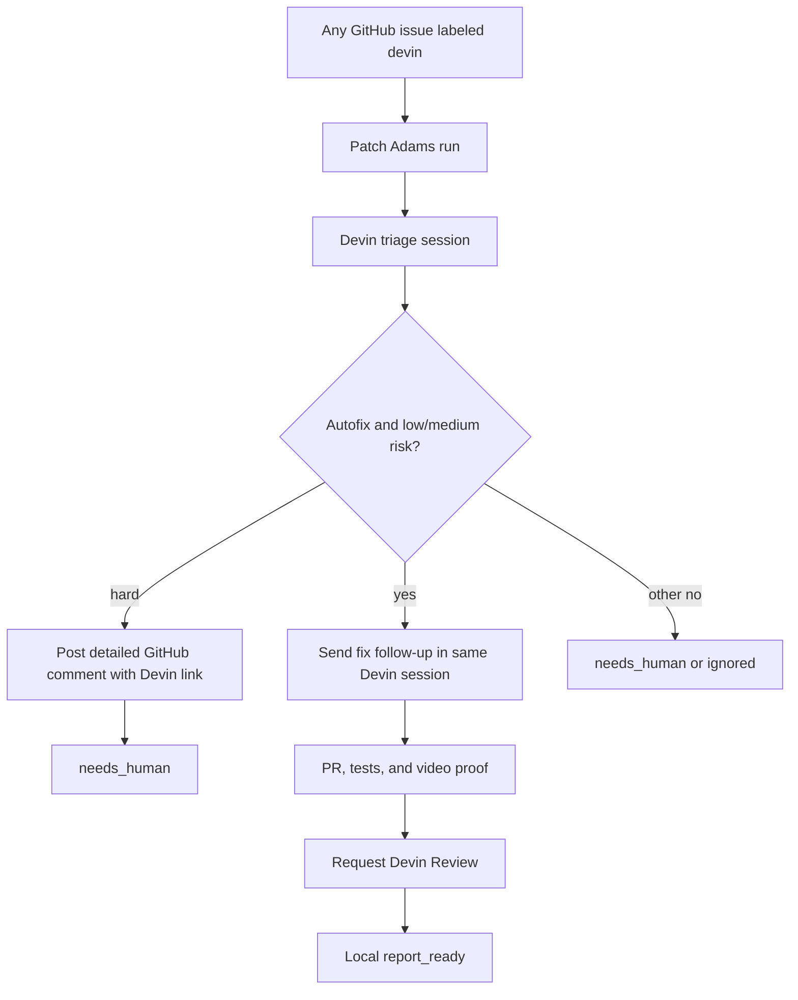
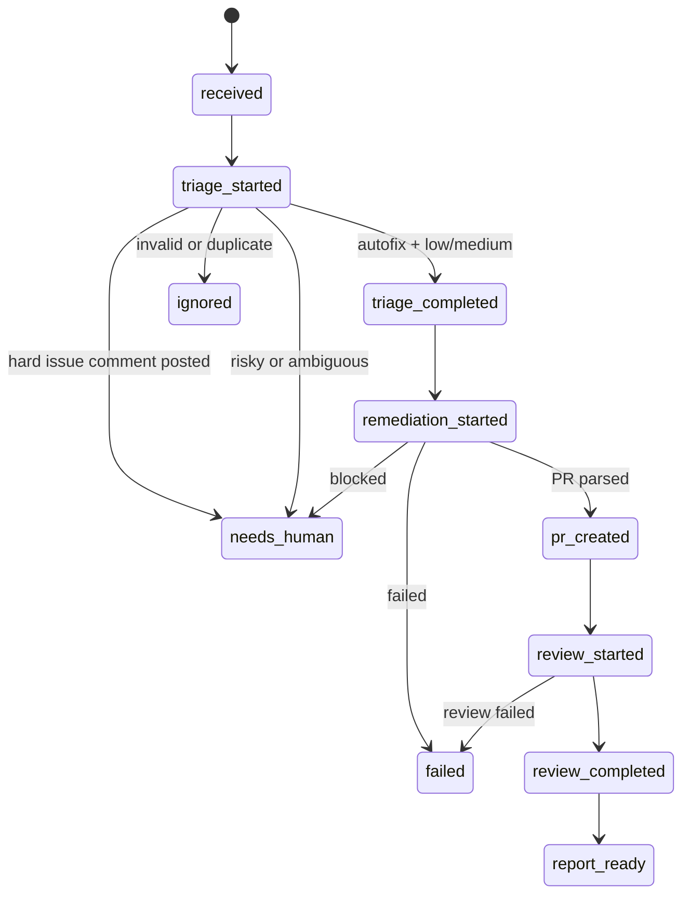

# Patch Adams

Patch Adams is a small FastAPI control plane for a take-home demo: add the `devin` label to a GitHub issue, start Devin triage, gate low/medium-risk autofix work into a same-session remediation follow-up, route hard issues to a human-in-the-loop Devin handoff, poll for a PR, request Devin Review, and show the outcome in a dashboard.

For an in-depth and up-to-date breakdown of Patch Adams—its architecture, components, and workflow goals—view the project overview here: https://www.proofeditor.ai/d/hoieaz8s?token=5e66c7c2-79d4-4ee9-b0d2-e52f2e0301cd

## Required Environment

Create `.env` locally or export these values before running:

```bash
SUPABASE_URL=...
SUPABASE_SERVICE_ROLE_KEY=...
DEVIN_API_KEY=...
DEVIN_ORG_ID=...
GITHUB_TOKEN=...
PATCHOPS_PUBLIC_URL=http://localhost:8000
```

`SUPABASE_URL`, `SUPABASE_SERVICE_ROLE_KEY`, `DEVIN_API_KEY`, and `DEVIN_ORG_ID` are required by `/setup/validate`. `GITHUB_TOKEN` is required only for best-effort GitHub issue comments. `PATCHOPS_PUBLIC_URL` is optional but recommended for webhook acknowledgement links when the app is exposed through a tunnel or deployment URL.

The app expects the existing `Cognition` Supabase schema with `runs` and `run_events`. Secrets stay server-side; do not expose the service-role key to browser code.

## Run Locally

```bash
python -m venv .venv
./.venv/bin/python -m pip install -r requirements.txt
./.venv/bin/uvicorn app.main:app --reload
```

Open `http://localhost:8000/` for the issue-card dashboard.

For local demo development, run the app and worker together:

```bash
./.venv/bin/python dev.py
```

Validate setup:

```bash
curl http://localhost:8000/setup/validate
```

## Run With Docker

```bash
docker compose up --build
```

The service listens on `http://localhost:8000/`.

Docker Compose starts the FastAPI service. Run the worker separately when you want automatic polling:

```bash
docker compose exec patch-adams python -m app.worker
```

The current Compose file passes the Supabase and Devin variables. If you need GitHub comments from inside Docker, also pass `GITHUB_TOKEN`; if the app is exposed through a tunnel, pass `PATCHOPS_PUBLIC_URL` so acknowledgement comments link to the public dashboard.

## Real Demo Flow

1. Configure a GitHub webhook to POST issue events to `/github/webhook`.
2. Add the `devin` label to a supported Superset issue.
3. The app creates or reuses one non-failed run for that issue and records a `received` event.
4. Start the worker loop:

```bash
./.venv/bin/python -m app.worker
```

The worker polls active runs every 5 seconds. It starts triage, gates `autofix` plus `low` or `medium` risk into a follow-up message in the same Devin session, extracts PR/test/video evidence, requests Devin Review, archives the Devin session after review, then marks the report ready. If triage returns `hard`, Patch Adams posts a detailed GitHub Issue comment, explains why the run should stay human-in-the-loop, links to Devin, and stops the run as `needs_human`.

For deterministic debugging, tick once:

```bash
curl -X POST http://localhost:8000/worker/tick
```

## Simulation Flow

Use `/demo/trigger` when webhook delivery is not available:

```bash
curl -X POST http://localhost:8000/demo/trigger \
  -H "Content-Type: application/json" \
  -d '{
    "issue_number": 123,
    "issue_url": "https://github.com/apache/superset/issues/123",
    "issue_title": "Demo issue"
  }'
```

Pass `"reset_existing": true` only when you want to terminalize a stale active run for that same issue before recreating the demo.

## Dashboard And Report

The dashboard shows:

- Seeded demo summary metrics plus live Supabase-backed run cards.
- One expandable card per issue with issue, status, triage/risk, and PR/report output.
- A vertical timeline from received through report-ready.
- Devin triage/remediation/review links, review status, tests run, video URL, summary, blockers, retry actions for transient Devin timeouts, and continue actions when Devin is waiting for human input.
- Collapsed `run_events` history for auditability.

The final report is stored as a `report_ready` event with metadata covering the trigger source, policy gate, human-stop condition, PR URL, Devin Review status, tests, video proof when available, patch-quality evidence, limitations, and safety rationale.

## Workflow Diagrams





## Scoped Reset

Avoid broad deletes during demos. Use the simulation request with `"reset_existing": true` for one issue, or update only stale active rows for the specific issue you are replaying. Keep `run_events` so the demo narrative remains auditable.

## Current Limitations

- The dashboard intentionally appends seeded demo rows and summary metrics to live runs so reviewers can see the intended end state even before fresh data exists.
- GitHub webhook comments are best-effort and are skipped when `GITHUB_TOKEN` is missing or invalid.
- Remediation sessions that are waiting for user approval remain active for the worker to revisit; they do not currently auto-transition to `needs_human`.
- Webhook signature verification, queue-backed workers, client-safe Supabase policies, and production-grade auth are outside this take-home demo.

## Tests

```bash
./.venv/bin/python -m pytest tests
```
