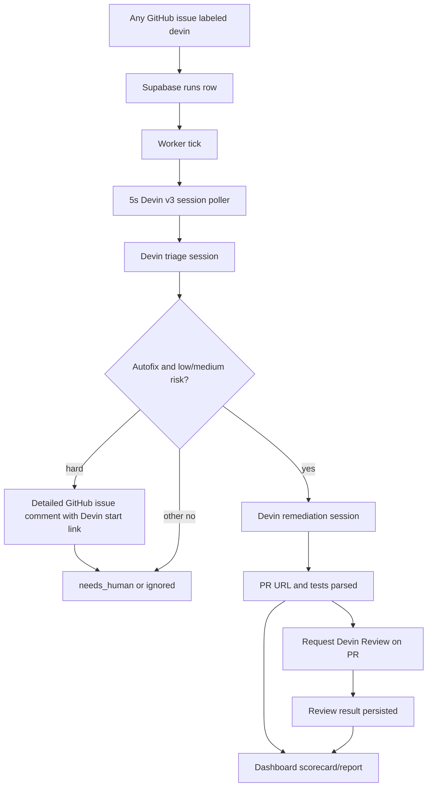

# feat: Patch Adams demo

## Summary

Tighten Patch Adams into an end-to-end take-home demo: adding the `devin` label to a GitHub issue enters the control plane, Devin triages it, low/medium-risk autofix launches remediation, hard issues get a human-in-the-loop GitHub comment with a Devin start link, a 5-second poller captures session status and PR output, and the dashboard/report answers whether the automation is working across issue runs.

---

## Problem Frame

The challenge rewards a working event-driven automation over polish. The current app already has the right skeleton: FastAPI routes, Supabase-backed `runs` and `run_events`, Devin triage session creation, triage message parsing, and a dashboard shell. The current Supabase project already contains the core Patch Adams tables and one active triage run, so the remaining plan should extend the existing control plane rather than recreate the basics.

The VP Engineering pitch is: Devin is not just a coding helper; it is an event-driven engineering worker that can be started, supervised, and measured by a control plane.

---

## Requirements

**Demo path**

- R1. A GitHub issue `labeled` event with label `devin` creates exactly one run for that Superset issue unless the previous run for that issue has `failed`; duplicate label events reuse/ignore the existing non-failed run and record an event instead of creating another run.
- R2. The worker polls active Devin sessions every 5 seconds using Devin v3 organization sessions data and advances triage using status, status detail, structured output, PR data, or messages when available.
- R3. `autofix` plus `low` or `medium` risk triage advances into remediation; `hard`, ambiguous, invalid, or high-risk issues stop with observable status.
- R4. A remediation session prompts Devin to make the smallest safe Superset change, update nearby tests when appropriate, run targeted checks, open a PR, and return structured outcome data.
- R5. The worker polls each active run every 5 seconds, extracts PR URL, test list, UI-change flag, optional video/recording link, summary, and failure/blocker information, then persists it on that run.
- R6. The worker stops polling a run once it reaches a terminal status such as `report_ready`, `verified`, `failed`, `needs_human`, or `ignored`, while continuing to poll other active issue runs independently.
- R7. When the GitHub webhook accepts a `devin` label trigger, the system posts an acknowledgement comment on the same GitHub issue/PR thread: "Devin is responding to your query! Follow up with the actions in Patch Adams at [link]" using the run's Patch Adams follow-up link. Comment posting is best-effort so missing GitHub comment credentials do not prevent run creation.
- R8. When triage rates an issue as `hard`, the system posts a detailed GitHub issue comment explaining that the request may require a large Devin run, marks the run `needs_human`, and gives the requester a Devin start link so a human can launch the issue intentionally.

**Observability**

- R9. Every material transition writes a `run_events` entry with enough metadata to reconstruct the demo narrative.
- R10. The dashboard shows current status, issue link, Devin session links, triage decision/risk, PR link, tests or summary, errors, simple metrics, and the run's `run_events` history hidden behind an accordion inside the issue entry.
- R11. Each issue renders as a demo-friendly card: four static summary details across the top, then a vertical step-by-step timeline with loader icons for in-progress work, check markers for completed steps, and neutral default icons for pending/not-started steps.
- R12. The final report includes a VP/senior-IC scorecard: trigger source, policy gate, human-stop condition, time-to-PR, tests/checks run, PR outcome, patch-quality evidence, known limitations, and why supervised Devin is safer than unsupervised automation.
- R13. After Devin creates a PR, the system requests Devin Review on that PR, waits for the review result, persists review status/details, and includes the review outcome in the final report.

**Submission readiness**

- R14. Docker and README instructions let a reviewer run or simulate the workflow with supplied environment variables.

---

## Key Technical Decisions

- **GitHub label is the real trigger:** Adding the `devin` label to a Superset issue is the event source. Keep `/demo/trigger` only as a local simulation fallback for development and recording recovery.
- **Webhook acknowledgement closes the loop:** When the label webhook is accepted, post a best-effort GitHub comment on the same issue/PR thread that tells the requester "Devin is responding to your query! Follow up with the actions in Patch Adams at [link]" and links back to the Patch Adams run. Use GitHub's issue comments API because PR conversation threads are issues under the hood.
- **All labeled Superset issues use the same flow:** Any issue in the Superset fork that receives the `devin` label should enter the same tracked triage, remediation, review, and reporting lifecycle.
- **Use the existing persistence contract as-is:** Supabase already has enough `runs` and `run_events` fields for the demo: triage/remediation session IDs, PR URL, tests JSON, raw output JSON, timestamps, foreign key, and useful indexes. Do not change schema unless implementation proves a blocker.
- **PR creation plus Devin Review is the required finish line:** Treat `pr_created` followed by Devin Review completion and local scorecard/reporting as the required working demo.
- **Hard issues require human launch:** If triage rates an issue as `hard`, do not launch remediation automatically. Post a detailed issue comment that explains the likely large run, why Patch Adams wants a human in the loop, and where to start the issue in Devin.
- **Extend the existing polling state machine:** Continue with `/worker/tick` and the current synchronous FastAPI/Supabase shape. A queue, scheduler, or Supabase Realtime would add architecture without improving the take-home signal.
- **Poll per active run and stop at terminal states:** Use Devin's v3 organization sessions APIs for active triage/remediation sessions. Session creation stays under `POST /v3/organizations/{org_id}/sessions`, and polling uses v3 session list/detail data with filters such as `session_ids` so the worker can read `status`, `status_detail`, `structured_output`, `pull_requests`, tags, and session URL. Keep `/worker/tick` as the manual demo control, but let the background worker run the same transition logic on a 5-second cadence across active runs. Once a run reaches a terminal status, it must leave the active set so polling stops for that issue while other active runs continue.
- **Parse structured Devin output from messages:** Devin can show a useful final answer before the API reports a terminal session status. Both triage and remediation should inspect messages on each poll and advance when valid outcome JSON is present.
- **Devin Review is required after PR creation:** Always request Devin Review on the PR Devin creates, wait for its result, and include review status/details in the report. If review fails, the run should surface a blocker/failure honestly rather than skip review silently.
- **Capture video proof whenever available:** Devin can test an app after creating a PR and send a recording as a session attachment, but it is not guaranteed from the normal remediation result. Ask for testing/recording in the remediation or follow-up prompt, and whenever a recording attachment/link appears in session output, extracting and persisting `video_url` is required.
- **Keep observability boring:** Use `runs`, `run_events`, dashboard metrics, timestamps, normalized outcome fields, and links. This is enough to answer the engineering-leader question without building a metrics platform.

---

## High-Level Technical Design

```mermaid
stateDiagram-v2
  [*] --> received
  received --> triage_started
  triage_started --> triage_completed: autofix + low/medium
  triage_started --> needs_human: hard issue comment posted
  triage_started --> needs_human: other risky or ambiguous
  triage_started --> ignored: duplicate or invalid
  triage_started --> failed: API or parser failure
  triage_completed --> remediation_started
  remediation_started --> pr_created: PR result parsed
  remediation_started --> needs_human: blocked result parsed
  remediation_started --> failed: failed result parsed
  pr_created --> review_started: request Devin Review
  review_started --> review_completed
  review_started --> failed: review failed
  review_completed --> report_ready: local report persisted
  report_ready --> verified
```

---

## Scope Boundaries

### In Scope

- GitHub issue `labeled` webhook with label `devin` as the event surface for all issues in the Superset fork, plus `/demo/trigger` as a local simulation fallback.
- Supabase-backed runs/events as the control-plane store.
- Validation of the existing Supabase run fields this demo already uses.
- Devin triage and remediation sessions as the core primitive.
- Dashboard/reporting that makes the automation legible to senior engineers and engineering leaders, including one issue card per run with static details and a vertical progress timeline.
- Docker and README updates needed for the required submission.

---

## Implementation Units

### U1. Validate Existing Supabase Contract and Preconditions

- **Goal:** Confirm the existing Supabase schema and external credentials are ready before adding more state transitions.
- **Requirements:** R1, R2, R5, R6, R7, R9, R13
- **Dependencies:** None
- **Files:** `app/runs.py`, `app/devin_client.py`, `README.md`, `requirements.txt`, `tests/test_runs.py`, `tests/test_orchestrator.py`
- **Approach:** Treat the current Supabase project as the source of truth and do not add migrations for this demo. It already has `runs` and `run_events`, `run_events.run_id -> runs.id`, indexes for status/issue/created-at/event lookup, triage/remediation session fields, PR URL, review/UI fields, `tests_run`, raw output JSON fields, and timestamps. Add setup validation that checks those existing fields, then implement behavior using existing columns: represent `report_ready` as a `status`, store report details in existing summary/error/raw JSON fields as appropriate, and record webhook metadata in `run_events.metadata` rather than new columns. Add expected-status transition helpers and v3 Devin session polling via `GET /v3/organizations/{org_id}/sessions` using `session_ids` filters. Preflight Devin credentials and document the required GitHub access for the Superset fork. If Devin can fix but cannot open a PR, the honest fallback is a branch/diff summary plus blocker status.
- **Patterns to follow:** Existing `update_run`, `fail_run`, and `log_event` helpers, but with a tighter transition boundary.
- **Test scenarios:**
  - Schema/setup validation passes against the existing `runs` and `run_events` tables without requiring migrations.
  - Webhook metadata can be recorded in `run_events.metadata` without adding columns.
  - Report-ready details can be represented using existing run fields and event metadata.
  - Transition from an unexpected status does not overwrite a newer state or start a duplicate Devin session.
  - Terminal runs are excluded from active polling while other active runs continue.
  - Event logging failure is surfaced clearly and does not launch duplicate sessions.
  - Devin credential preflight returns an actionable failure before the demo reaches remediation.
  - v3 session polling client handles `running`, `exit`, `error`, `suspended`, `status_detail`, missing `structured_output`, and empty `pull_requests`.
  - Parser tests run without constructing a real Supabase client.
  - Dashboard/report rendering uses normalized fields and does not require raw message bodies.
- **Verification:** The current `Cognition` Supabase project passes the schema checks, credentials can be checked up front, and repeated worker ticks cannot advance the same run twice from the same status.

### U2. Add GitHub Label Trigger, Acknowledgement Comment, and Duplicate Guard

- **Goal:** Ensure adding the `devin` label to any supported Superset issue creates at most one non-failed run for that issue, immediately acknowledges the requester on GitHub, and allows retry after failure.
- **Requirements:** R1, R7, R9
- **Dependencies:** U1
- **Files:** `app/runs.py`, `app/main.py`, `app/github_client.py`, `app/templates/dashboard.html`, `tests/test_runs.py`, `tests/test_github_webhook.py`
- **Approach:** Add a GitHub webhook route for issue `labeled` events and accept only events where the label name is `devin`. Extract issue number, URL, title, repository, and sender metadata into the run. Before insert, look up the latest run for that issue: if the latest run is anything other than `failed`, return/reuse that run and log a duplicate-trigger event without creating a second run; if the latest run is `failed`, allow a new retry run. After create/reuse, post a best-effort GitHub issue comment to the same issue number in the repository with the acknowledgement "Devin is responding to your query! Follow up with the actions in Patch Adams at [link]" using `PATCHOPS_PUBLIC_URL` or a request-base dashboard anchor for the link. Keep comment failures observable in the webhook response but do not fail the run creation path. Keep `/demo/trigger` as a simulation fallback that follows the same duplicate/retry rule. Demo reset should terminalize stale active runs by issue, not broadly delete data.
- **Patterns to follow:** Existing `create_run`, `get_active_runs`, `update_run`, and `log_event` wrappers.
- **Test scenarios:**
  - GitHub `issues.labeled` webhook with label `devin` and no previous run for that issue inserts a `received` run and logs a `received` event.
  - GitHub `issues.labeled` webhook with a different label is ignored and does not create a run.
  - Adding `devin` when the latest run for the issue is non-failed returns the existing run, logs a duplicate-trigger event, and does not launch a second Devin session.
  - Adding `devin` when the latest run for the issue is `failed` creates a new retry run.
  - Accepted webhook trigger posts an acknowledgement comment on the same GitHub issue/PR thread with a Patch Adams follow-up link.
  - Missing or failing GitHub comment credentials return an acknowledgement skip reason without failing run creation.
  - `/demo/trigger` creates the same run shape as the webhook path for local simulation.
  - Active-run fetching excludes non-demo rows and terminal statuses.
  - Demo reset terminalizes stale runs by issue and preserves event history.
- **Verification:** The dashboard shows at most one non-failed run per issue, the GitHub thread gets a useful follow-up comment when credentials are present, and `/worker/tick` polls each active issue run independently.

### U3. Complete Triage Gate, Remediation Polling, and PR Extraction

- **Goal:** Advance low/medium autofix triage into remediation, route hard issues to a human-in-the-loop GitHub comment, and advance `remediation_started` into `pr_created`, `needs_human`, or `failed` based on Devin remediation output.
- **Requirements:** R2, R3, R4, R5, R6, R8, R9
- **Dependencies:** U1, U2
- **Files:** `app/orchestrator.py`, `app/prompts.py`, `app/runs.py`, `app/devin_client.py`, `app/worker.py`, `tests/test_orchestrator.py`
- **Approach:** Extend triage completion so only `autofix` plus `low` or `medium` starts remediation. If triage returns `hard`, post a detailed best-effort GitHub issue comment that summarizes the issue, explains that this could become a large Devin run, says Patch Adams prefers a human in the loop before spending that run, and includes a link to start the issue in Devin. Then mark the run `needs_human`, persist the comment/start-link metadata in events, and stop polling that run. Mirror the triage polling pattern for remediation, but source poll data from v3 organization session polling on a 5-second cadence per active run: inspect `structured_output` first, then `pull_requests[].pr_url`, then session messages if a separate v3 detail/messages call is available. Treat `running` with `status_detail` `working` as still active, `running` with `waiting_for_user` or `waiting_for_approval` as `needs_human`, and `exit` with PR data as ready to advance. Normalize status and persist PR URL, UI-change flag, tests run, optional video/recording link, summary, and errors through the transition helper. Keep blocked remediation honest by routing to `needs_human` with the blocker summary. Once this run advances to a terminal or waiting-for-human state, remove it from active polling without affecting other active issue runs. Raw message excerpts remain debug-only unless explicitly sanitized.
- **Execution note:** Add parser/state-transition tests before changing orchestration, because this is the highest-risk demo path.
- **Patterns to follow:** `poll_triage`, `complete_triage`, `maybe_extract_triage_json`, and `normalize_value`.
- **Test scenarios:**
  - Triage output with `autofix` plus `hard` posts a detailed GitHub issue comment with the large-run explanation and Devin start link, marks the run `needs_human`, and does not start remediation.
  - Missing or failing GitHub comment credentials for a hard issue still mark the run `needs_human`, log the comment failure, and expose the Devin start link in the dashboard/report fields.
  - Running remediation session with valid PR outcome in v3 `structured_output` advances to `pr_created` even if Devin status is still `running`.
  - Running remediation session with only `pull_requests[].pr_url` available advances to `pr_created` and records missing test/summary fields as limitations.
  - Running remediation session with a recording attachment or video link available from v3 session output/messages always stores `video_url` on the run.
  - Running remediation session without a recording leaves `video_url` empty and records video proof as unavailable, not failed.
  - Running remediation session with valid PR outcome in available v3 messages advances to `pr_created` even if Devin status is still `running`.
  - Terminal remediation session with valid PR outcome advances to `pr_created`.
  - `running` session with `status_detail` `waiting_for_user` or `waiting_for_approval` advances to `needs_human`, stores summary/error context, and logs an event.
  - Valid failed outcome advances to `failed`, stores error context, and logs an event.
  - Missing or malformed remediation output while session status is `running` with `status_detail` `working` leaves the run in `remediation_started`.
  - Missing or malformed remediation output after terminal session fails safely with a readable error.
  - Repeated worker ticks after PR extraction do not create duplicate report/review transitions.
  - With two active runs, one terminal run stops polling while the other continues on the next 5-second worker cycle.
- **Verification:** A real worker tick can move an issue run from `remediation_started` to `pr_created` with a PR link visible in persisted run data.

### U4. Generate the Required Local Report

- **Goal:** Request Devin Review after PR creation, wait for its result, and produce the final local report from PR plus review evidence.
- **Requirements:** R10, R12, R13
- **Dependencies:** U3
- **Files:** `app/orchestrator.py`, `app/runs.py`, `app/devin_client.py`, `tests/test_orchestrator.py`
- **Approach:** After `pr_created`, request Devin Review for the PR URL and move the run to `review_started`. Poll or inspect review output until the review result is available, then persist `review_status` and review details using existing run fields/events. Only after review completes should the system generate the local report and move to `report_ready`. The report should include triage decision, risk, category, policy gate, human-stop condition, Devin session links, PR URL, checks run, Devin Review outcome, optional video URL, patch-quality rationale, unresolved risks, and known limitations. UI/browser verification remains optional evidence beyond the required Devin Review.
- **Patterns to follow:** Existing state transition and event logging helpers.
- **Test scenarios:**
  - `pr_created` run advances to `review_started` after the system requests Devin Review on the PR.
  - Review result advances the run to `review_completed`, persists `review_status`, and logs a review event.
  - Review failure advances the run to `failed` or `needs_human` with a clear blocker.
  - `review_completed` run advances to `report_ready` after the local report fields are persisted.
  - UI-change flag false does not require UI verification before the report is usable.
  - UI-change flag true records that UI verification is needed if it is not completed.
  - Report generation includes issue URL, PR URL, Devin session URLs, triage fields, checks run, Devin Review outcome, optional video URL, patch-quality rationale, and limitations.
- **Verification:** The demo can show a final proof artifact that includes Devin Review status for the PR Devin created.

### U5. Make Dashboard Metrics and Issue Cards Match the Data

- **Goal:** Make the dashboard accurate, readable, and aligned with the fields the app actually persists.
- **Requirements:** R8, R9, R10, R11, R12
- **Dependencies:** U3, U4
- **Files:** `app/main.py`, `app/templates/dashboard.html`, `tests/test_dashboard.py`
- **Approach:** Reconcile metric names between `main.py` and the template, add the fields needed for the report surface, and replace the flat issue table with one readable card per run. Each card should show four static details across the top, such as issue, current status, triage/risk, and PR/report link. Below that, render a vertical timeline of workflow steps using loader icons for active steps, check markers for completed steps, and neutral default icons for pending/not-started steps. Include the raw `run_events` history for that run behind a collapsed accordion inside the same issue card so technical reviewers can inspect the underlying audit trail without cluttering the default view. Keep the styling simple and screenshot-friendly rather than building a full design system.
- **Patterns to follow:** Existing `dashboard` route and Jinja template.
- **Test scenarios:**
  - Dashboard route renders with an empty run list.
  - Dashboard metrics count triaged, autofixable, PR-created, reviewed/verified, and failed runs consistently.
  - A run with triage, remediation, and report data renders the four static issue-card details and the vertical timeline.
  - Timeline steps show completed, active, and pending states with the correct icon treatment for received, triage, remediation, PR, and report steps.
  - Each issue card includes a collapsed events accordion containing that run's `run_events` entries in chronological order.
  - Template does not reference missing metric keys.
- **Verification:** Refreshing `/` shows a coherent issue-card progression, expandable event history, and no template/key errors.

### U6. Package the Submission Path

- **Goal:** Make the project runnable or simulatable by evaluators.
- **Requirements:** R10, R11, R12, R13, R14
- **Dependencies:** U1, U3, U4, U5
- **Files:** `Dockerfile`, `docker-compose.yml`, `README.md`, `requirements.txt`
- **Approach:** Fill the existing empty Docker and README files with the minimal instructions needed to configure Supabase/Devin variables, prepare schema, configure the GitHub webhook, trigger the demo by adding the `devin` label, run the 5-second worker poller, manually tick the worker for deterministic debugging, inspect the issue-card dashboard, and understand the report. Include a simulation path, a real Devin path, and a scoped reset checklist. Explain that `/demo/trigger` and `/worker/tick` are deterministic local controls, while the GitHub label trigger, 5-second poller, and run/event/policy model are the durable product idea.
- **Patterns to follow:** Current single-service Python app layout.
- **Test scenarios:**
  - Docker image starts the FastAPI app with required environment variables supplied.
  - README instructions describe required environment variables and schema setup without including secret values.
  - README explains the exact demo narrative: trigger, worker tick, Devin session, PR, dashboard/report.
  - README reset instructions terminalize stale demo runs without encouraging broad deletes.
  - Missing environment variables fail with actionable errors rather than silent behavior.
- **Verification:** A reviewer can follow the README to understand how to run or simulate the workflow and where to look for outputs.

### U7. Remove Stale Code and Unused Demo Artifacts

- **Goal:** Leave the repo focused on the final Patch Adams flow by deleting or simplifying code that no longer supports it.
- **Requirements:** R11, R13
- **Dependencies:** U1, U2, U3, U4, U5, U6
- **Files:** `app/demo_trigger.py`, `app/main.py`, `app/orchestrator.py`, `app/prompts.py`, `app/worker.py`, `README.md`, `tests/test_cleanup.py`
- **Approach:** After the GitHub-label flow, v3 polling, Devin Review, report, dashboard, and packaging paths are implemented, audit the repo for dead code and stale placeholders. Remove unused duplicate trigger modules, old v1 API helpers, unused prompt functions, abandoned UI verification branches, placeholder Docker/README fragments, and any test scaffolding that no longer maps to the final flow. Keep `/demo/trigger` only if it remains an intentionally documented local simulation fallback; otherwise remove it and its references.
- **Patterns to follow:** Prefer deletion over compatibility shims for unshipped take-home code. Keep the smallest code surface that supports the implemented flow.
- **Test scenarios:**
  - No imports reference deleted modules or functions.
  - README mentions only supported routes and workflows.
  - Dashboard, worker, webhook, polling, review, and report tests still pass after cleanup.
  - Local simulation fallback is either documented and tested or fully removed.
- **Verification:** A repo search shows no stale v1 Devin API references, no unused duplicate trigger code, and no documented workflow that the app no longer supports.

---

## Acceptance Examples

- AE1. Given a Superset issue has no previous run, when the `devin` label is added in GitHub, then the webhook creates one issue card with four static details and a `received` timeline step.
- AE2. Given a Superset issue already has a non-failed run, when the `devin` label is added again, then no duplicate run is created and a duplicate-trigger event is recorded on the existing run.
- AE3. Given a Superset issue's latest run has `failed`, when the `devin` label is added again, then a new retry run is created.
- AE4. Given the `devin` label webhook creates or reuses a run, when GitHub comment credentials are configured, then the app comments on the same issue/PR thread that Devin is responding and links to the Patch Adams run for follow-up actions.
- AE5. Given GitHub comment credentials are missing or the comment API fails, when the `devin` label webhook is received, then the run is still created or reused and the webhook response includes an acknowledgement skip reason.
- AE6. Given a triage session detail response contains valid autofix/low-risk or autofix/medium-risk structured output or message JSON, when the 5-second worker poll runs, then the run becomes `triage_completed` and stores decision, risk, category, summary, and recommended fix.
- AE7. Given a triage session detail response rates an issue as `hard`, when the 5-second worker poll runs, then the app comments on the GitHub issue with a detailed large-run explanation and Devin start link, marks the run `needs_human`, and does not start remediation.
- AE8. Given a `triage_completed` run, when `/worker/tick` runs twice, then the system starts only one Devin remediation session and stores its session link.
- AE9. Given v3 remediation session data includes structured output, `pull_requests[].pr_url`, or message JSON with a PR-created outcome, when the 5-second worker poll runs, then the run becomes `pr_created`, stores the PR URL, tests run, video URL whenever a recording is present, summary, and logs a transition event.
- AE10. Given the run reaches `pr_created`, when the system requests Devin Review and receives a review result, then the run advances through `review_started` and `review_completed` to `report_ready`, displaying review status alongside session links, tests, PR link, optional video proof, patch-quality evidence, limitations, and completed timeline markers.
- AE11. Given a run has `run_events`, when its dashboard card renders, then the event history is available in a collapsed accordion without cluttering the default card view.
- AE12. Given multiple issue runs are active, when one run reaches a terminal status, then the worker stops polling that run and continues polling the remaining active runs.
- AE13. Given the full flow is implemented, when cleanup is complete, then no unused trigger modules, obsolete Devin API helpers, or unsupported README workflows remain.

---

## Risks & Dependencies

- **Devin session status may lag message output:** Mitigated by parsing messages while sessions are still running for both triage and remediation.
- **GitHub webhook setup can fail during demo:** Mitigated by keeping `/demo/trigger` as an equivalent local simulation fallback while making the label webhook the primary path.
- **GitHub acknowledgement comment can fail:** Mitigated by treating the comment as best-effort and returning a clear skip reason while still creating or reusing the Patch Adams run.
- **Hard-issue comment can fail:** Mitigated by still marking the run `needs_human`, logging the comment failure, and surfacing the Devin start link in Patch Adams so the requester has a manual path.
- **Devin v3 response shape can differ by endpoint:** Mitigated by centralizing v3 session response normalization for `status`, `status_detail`, `structured_output`, `pull_requests`, tags, and URLs.
- **Five-second polling may hit rate limits if broadened:** Mitigated by polling only active triage/remediation/review sessions and stopping each run at terminal status.
- **Structured JSON may be wrapped in prose:** Mitigated by tolerant extraction from nested payloads, fenced JSON, and JSON-looking message text.
- **Devin Review integration may fail or be unavailable:** Mitigated by surfacing `failed` or `needs_human` clearly with the PR link and blocker details rather than silently skipping review.
- **Supabase schema may be implicit:** Mitigated by validating the existing tables at startup/setup and using current columns only.
- **Supabase RLS is currently disabled on `runs` and `run_events`:** Acceptable for a private take-home demo only if service credentials stay server-side; flag this in README and defer policy design unless exposing client-side Supabase access.
- **Repeated worker ticks can race:** Mitigated by transition preconditions that update only from the expected current status.
- **Run state and event history can diverge:** Mitigated by surfacing event logging failures clearly and avoiding duplicate session launches after partial failures.
- **Raw Devin payloads may contain sensitive or bulky content:** Mitigated by making raw retention optional/debug-only and rendering normalized safe fields.
- **Dashboard can break from metric drift:** Mitigated by a dedicated dashboard unit and template rendering tests.
- **Timebox pressure:** Mitigated by making each run's required path narrow: one issue, one PR, one Devin Review, then `report_ready`.

---

## Documentation / Operational Notes

- The README should name the required environment variables but never include real values.
- The README should include a scoped reset note for stale runs, since repeatable demos depend on clean per-issue run history.
- `.env` is locally present and ignored by git; if any secret was shared outside the machine, rotate it before submission.
- The README should state that the app uses the existing `Cognition` Supabase project schema as-is rather than asking evaluators to recreate or migrate tables.
- The final pitch should explicitly say where the current prototype ends and what would be added for a customer deployment.

---

## Sources & Research

- Devin API overview confirms v3 organization-scoped sessions under `https://api.devin.ai/v3/organizations/*`, service-user authentication, session creation, and standard error behavior.
- Devin v3 List Sessions docs show `GET /v3/organizations/{org_id}/sessions` supports `session_ids`, tags, repo filters, and returns session status, `status_detail`, `structured_output`, `pull_requests`, tags, and session URL, making v3 the API family for polling and dashboard updates.
- Devin testing and recordings docs say recordings are produced when Devin enters testing mode after PR creation or when explicitly asked to test and send a recording; recordings are delivered as session message attachments rather than guaranteed PR metadata.
- Supabase `Cognition` project `egfhchucnlgjtaelswam` already has `public.runs` and `public.run_events`, with one active `triage_started` run and `received` / `triage_started` events. The tables include the current triage/remediation fields, PR URL, tests JSON, raw output JSON fields, timestamps, indexes, and `run_events.run_id` foreign key.
- Repo research found a small FastAPI/Supabase control plane with state orchestration in `app/orchestrator.py`, persistence in `app/runs.py`, prompts in `app/prompts.py`, Devin API calls in `app/devin_client.py`, and dashboard rendering in `app/main.py` plus `app/templates/dashboard.html`.
- No `docs/solutions/`, `AGENTS.md`, or `CLAUDE.md` guidance exists in this repo.
